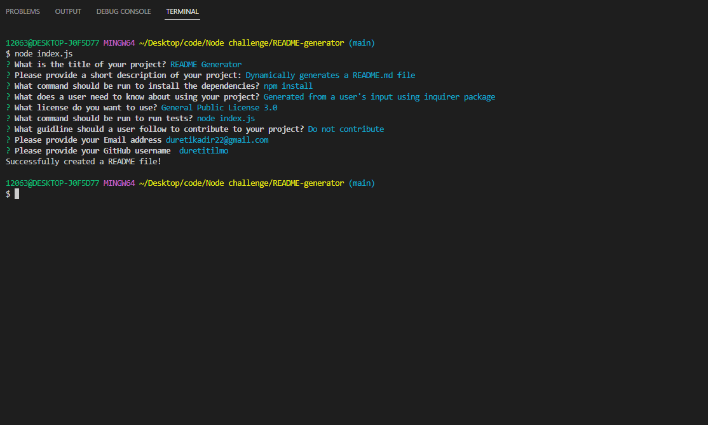

# README Generator

## Description

A starter code was provided for this challenge to create a command-line application that dynamically generates a professinoal README.md file from a user's input using an environment, like package.json. Answers to prompts are used to determine the templates and contents of the file. A default value for when a user doesn't input anything, object destructuring, template literals and many more node.js extended functionalities are implemented to build this application. 

### Screencastify Link: [https://drive.google.com/file/d/1lKaMYXYaV4_0dvcCeXL6aDW5r6E84-uM/view]
### GitHub URL: [https://github.com/DuretiTilmo/README-generator]

### Screenshots

--------------------------------

-----------------------------------------

## License

MIT License 

## Questions

  - Email Address: duretikadir22@gmail.com

--------------------------------

&copy; Copyright 2023 